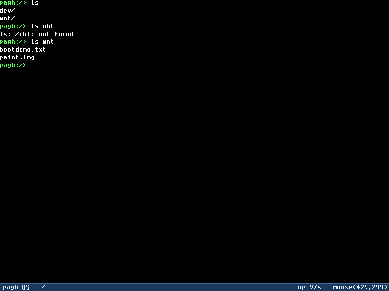

<h1 align="center">pagh</h1>

<p align="center">
  A small 64-bit OS kernel in Rust — ext2 + WAL journaling, a TCP/IP stack,
  a framebuffer GUI, and a mouse-driven paint app, booting on real UEFI via Limine.
</p>

<p align="center">
  
  
  
  
  
</p>

---

A small 64-bit operating system kernel written in Rust (`#![no_std]`), booted via the
[Limine](https://github.com/limine-bootloader/limine) boot protocol on x86_64 and run
under QEMU/OVMF.

`pagh` brings up serial, the GDT/IDT, a bitmap physical memory manager, 4-level paging,
a heap, the APIC (LAPIC timer + I/O APIC), a PS/2 keyboard and mouse, a framebuffer
console with 2D graphics primitives and a software cursor, a virtual filesystem, an ELF64
loader, a preemptive round-robin scheduler, a `SYSCALL`/`int 0x80` interface, PCI
enumeration with virtio drivers, a TCP/IP network stack, a journaled ext2 filesystem on a
real disk, and a friendly interactive shell with line editing, history, tab completion,
and colored output. It can load and run an embedded test program in ring 3, and ships a
full-screen mouse-driven `paint` application.

> Hobby/educational kernel. There is no security model beyond ring 0/3 paging.

---

## Screenshots

<!--
Add a few images/GIFs here — they do the most to attract interest. Suggestions:
  - the boot log + shell prompt on serial/framebuffer
  - the `paint` app in action (a short GIF is ideal)
  - `ls`/`cat`/`ifconfig` output in the colored shell
Drop files in a `docs/` or `assets/` folder and reference them:
  
  
-->

_Coming soon — drop boot/shell/paint screenshots here._

---

## Features at a glance

- **Core:** safe privileged-instruction layer (incl. SSE enablement), GDT/IDT/TSS/IST,
  bitmap PMM, 4-level paging VMM with `map_mmio`, `linked_list_allocator` heap, ACPI (MADT),
  LAPIC + I/O APIC.
- **Tasking:** preemptive ~100 Hz round-robin scheduler, kernel threads, ring-3 user
  processes, `int 0x80` syscalls (`SYS_WRITE`/`EXIT`/`YIELD`).
- **Input & graphics:** PS/2 keyboard (IRQ1) and mouse (IRQ12), a framebuffer console with
  2D primitives (lines, rectangles, circles, fills, blit), a bottom status bar, and a
  trailing-free software mouse cursor.
- **Storage:** PCI enumeration, virtio-blk block device, an ext2-compatible read/write
  filesystem mounted at `/mnt`, protected by a write-ahead-log (WAL) journal for crash
  consistency. The on-disk image is host-mountable (`mount -t ext2 -o loop disk.img`).
- **Networking:** virtio-net NIC driven through [`smoltcp`](https://github.com/smoltcp-rs/smoltcp)
  — DHCPv4 addressing, ICMP echo (ping), UDP echo, and a TCP echo server + client.
- **Shell:** line editing (arrows/Home/End/Delete/insert), command history, tab
  completion, `cd`/`pwd` with relative paths, file ops (`cp`/`mv`/`stat`), colored
  prompt/errors, typo suggestions, a registry-driven `help`, and a `paint` app.

---

## Quick start

### Prerequisites

- **Rust nightly** with the `rust-src` component (for `build-std`):
  ```sh
  rustup toolchain install nightly
  rustup component add rust-src --toolchain nightly
  ```
  `rust-lld` ships with the toolchain and is used as the linker.
- **QEMU** (`qemu-system-x86_64`) on your `PATH`. `qemu-img` is used to create the disk
  image on first run.
- Two developer-provided blobs in the project root (they are git-ignored — see below):
  - `OVMF.fd` — UEFI firmware for QEMU.
  - `limine-12.3.1/` — the Limine bootloader tree (must contain `BOOTX64.EFI`).

### Build and run

The `run.cmd` script (Windows) drives the whole pipeline:

```bat
run.cmd build           :: cargo build + link PAGH.elf only
run.cmd run             :: build + link + boot in QEMU (default)
run.cmd run release     :: release build
```

`run.cmd`:
1. runs `cargo build` to produce the static library `libpagh.a`,
2. links it into `PAGH.elf` with `rust-lld` using `linker.ld`,
3. stages `iso_root/` (kernel + `BOOTX64.EFI` + a generated `limine.conf`),
4. creates a 64 MiB raw `disk.img` (via `qemu-img`) if it does not already exist,
5. launches QEMU with OVMF, a `virtio-blk-pci` drive, a `virtio-net-pci` NIC (user
   networking with host port-forwards), serial on stdio, and interrupt logging to
   `qemu_debug.log`.

The NIC is configured with host→guest forwards on TCP/UDP `localhost:5555 → guest :7`,
so you can reach the guest's echo services from the host.

Serial output (including the shell) appears on the console. Press `Ctrl-A` then `X` to
exit QEMU.

Just building the static library:

```sh
cargo build            # debug
cargo build --release  # release
```

---

## Boot output

On a clean boot you will see a concise, leveled log followed by the shell:

```
[INFO] serial
[INFO] base revision
[INFO] limine responses
[INFO] gdt + idt
[INFO] syscalls
[INFO] pmm
[INFO] vmm
[INFO] heap
[INFO] apic
[INFO] drivers
[INFO] virtio
[INFO] scheduler
[INFO] vfs
[INFO] ext2 mounted at /mnt
[INFO] fs demo: /mnt/bootdemo.txt write+read round-trip PASS (28 bytes)
[INFO] net
[INFO] user test process spawned (pid 3)
Hello from ring3 user process!
[INFO] interrupts enabled
[INFO] net: DHCP lease acquired: 10.0.2.15/24 gw 10.0.2.2
========================================
   Welcome to pagh OS Shell!
========================================
Type 'help' for available commands
pagh:/>
```

The default log level is `INFO`; `debug!`/`trace!` output is filtered out. Boot runs as an
ordered sequence of fallible init steps (`boot::start`); SSE is enabled first, then each
step logs one concise `info!` line. The `ext2 mounted at /mnt` step also runs a one-shot
journaled write/read self-demo. The `Hello from ring3 user process!` line is printed by an
embedded ELF executing in ring 3 via a `SYS_WRITE` system call. The DHCP lease is acquired
asynchronously by the network poll thread once interrupts are enabled, so it appears after
the prompt. The prompt shows the current working directory and is rendered in color on the
framebuffer (serial stays plain text).

### Shell commands

| Command              | Description                                                     |
|----------------------|-----------------------------------------------------------------|
| `help [cmd]`         | List commands, or show usage/description for one command        |
| `clear`              | Clear the framebuffer screen                                    |
| `echo …`             | Echo the arguments                                              |
| `uptime`             | Show scheduler ticks (~100 Hz)                                  |
| `pwd`                | Print the current working directory                             |
| `cd [path]`          | Change directory (relative or absolute; no arg → `/`)           |
| `ls [path]`          | List a directory (defaults to the CWD; dirs shown with `/`)     |
| `cat path`           | Print the contents of a file                                    |
| `cp src dst`         | Copy a file                                                     |
| `mv src dst`         | Move/rename a file                                              |
| `stat path`          | Show file/directory info                                        |
| `mkdir path`         | Create a directory                                              |
| `touch path`         | Create an empty file                                            |
| `write path text`    | Write text to a file (journaled)                                |
| `rm path`            | Remove a file or empty directory                                |
| `sync`               | Flush the mounted filesystem                                    |
| `fscrash`            | Demo journal replay + persistence (write → remount → verify)    |
| `sleep <seconds>`    | Sleep for N seconds                                             |
| `paint`              | Launch the full-screen mouse-driven framebuffer paint app       |
| `pci`                | List enumerated PCI devices (virtio tagged)                     |
| `ifconfig`           | Show the network interface (IP, gateway, MAC)                   |
| `nc <ip> <port> [t]` | Open a TCP connection and echo a line over it                   |
| `exec`               | Run the embedded ring-3 test process                            |
| `selftest`           | Run the in-kernel correctness self-test suite (serial)          |

**Line editing & UX.** The shell supports a movable cursor (Left/Right/Home/End),
mid-line insert/Backspace/Delete, command history (Up/Down), and Tab completion for
command names and VFS paths. Unknown commands get a nearest-match "did you mean …?"
suggestion. Paths are resolved against the current working directory (`.`/`..`
supported), and prompt/errors/success are color-coded on the framebuffer.

> Console note: the framebuffer console only supports destructive backspace and has no
> non-destructive cursor positioning, so during mid-line edits the visible caret rests at
> end-of-line while the logical cursor is placed correctly — the buffer content always
> renders accurately.

### Graphics & the `paint` app

The framebuffer driver is not just a text console: it exposes 2D primitives (pixels,
filled/outline rectangles, lines and thick lines, circles and discs, and `blit`) plus a
bottom status bar. A PS/2 mouse (IRQ12) feeds an absolute, screen-clamped cursor position
and button state, drawn as a trailing-free software arrow cursor (`drivers::cursor`) that
saves and restores the pixels beneath it.

`paint` ties these together into a full-screen drawing application launched from the shell:

- **Tools:** Pencil, Eraser, Line, Rectangle, Filled Rectangle, Circle, Disc, Bucket fill,
  and color Picker — shape tools show a live rubber-band preview while dragging.
- **Color:** a 16-entry palette (toolbar swatches, or number keys `1`–`0`); left button
  paints, right button quick-erases to white.
- **Editing:** keyboard shortcuts for tools, brush size (`[`/`]`), undo/redo (`u`),
  clear (`x`), and save/load the canvas to `/mnt/paint.img` (`s`/`g`) via the ext2 FS.
- **Exit:** `Esc` or `q` returns to the shell.

### Trying the network from the host

With the guest booted (DHCP lease `10.0.2.15`):

```sh
# TCP echo (host forward 5555 → guest 7)
printf 'hello pagh' | nc 127.0.0.1 5555

# UDP echo (host forward 5555 → guest 7)
printf 'hello pagh' | nc -u 127.0.0.1 5555
```

From inside the guest shell you can also drive the TCP client: `nc 10.0.2.2 <port> text`.

---

## Architecture

```
Limine ──hands off──▶ _start (lib.rs) ──▶ boot::start()  (ordered init steps)
                                              │
   ┌───────────────┬───────────────┬─────────┼──────────┬───────────┬───────────┐
   ▼               ▼               ▼          ▼          ▼           ▼           ▼
arch::cpu       gdt/idt         memory      apic      drivers      fs / net    vfs /
(safe priv.   (descriptors,  (pmm/vmm/heap (LAPIC,   (serial,     (ext2+WAL,   scheduler
 instrs, SSE)  TSS, IST)      /layout)      I/O APIC) ps2_kbd/mouse,virtio-net  (lookup_path,
                                                      cursor,      + smoltcp)   ELF loader,
                                                      framebuf+gfx,             round-robin)
                                                      pci, virtio)
```

The kernel is built as a `staticlib` (`libpagh.a`) and linked into a higher-half ELF
(load address `0xffffffff80000000`, set by `linker.ld`).

### Source layout

```
src/
├── lib.rs              # crate attrs, Limine request statics, global cells, panic handler, _start
├── boot.rs             # boot orchestrator: ordered, fallible init steps (incl. storage + net)
├── log.rs              # leveled logging facade (error!/warn!/info!/debug!/trace!)
├── test.rs             # in-kernel test/self-test harness (Properties P1–P27)
├── shell/              # interactive shell (thin I/O loop over pure-logic modules)
│   ├── mod.rs          #   prompt loop: Decoder + LineEditor + History + completion + dispatch
│   ├── keys.rs         #   KeyEvent + scancode Decoder (0xE0 extended-prefix state machine)
│   ├── editor.rs       #   LineEditor (buffer + char-unit cursor; insert/delete/move)
│   ├── history.rs      #   bounded command-history ring buffer with recall
│   ├── complete.rs     #   command + path tab completion, longest-common-prefix
│   ├── suggest.rs      #   bounded edit distance + nearest-command typo suggestion
│   ├── path.rs         #   CWD state + pure path normalize/resolve (`.`/`..`, clamp at root)
│   ├── registry.rs     #   single CommandSpec table driving dispatch and help
│   ├── render.rs       #   color palette + styled prompt/error/success (serial stays plain)
│   ├── commands.rs     #   command handlers (ls, cd, cat, cp, mv, stat, write, nc, …)
│   └── paint.rs        #   full-screen mouse-driven framebuffer paint application
├── arch/
│   ├── cpu.rs          # safe wrappers for privileged instrs (hlt/cli/sti/rd-/wrmsr, SSE)
│   └── x86_64/
│       ├── gdt.rs      # GDT, TSS, IST stacks, segment selectors, RSP0
│       ├── idt.rs      # IDT, exception handlers, IRQ + int 0x80 dispatch
│       ├── apic.rs     # LAPIC timer, I/O APIC, IRQ routing
│       ├── acpi.rs     # MADT parsing via the `acpi` crate (cached)
│       └── syscall.rs  # SYSCALL/int 0x80 entry + dispatcher (SYS_WRITE/EXIT/YIELD)
├── memory/
│   ├── layout.rs       # single source of truth for fixed virtual regions
│   ├── pmm.rs          # bitmap physical frame allocator (single Spinlock; contiguous alloc)
│   ├── vmm.rs          # 4-level paging, PageTableWalker, map_mmio, VmError
│   └── heap.rs         # global allocator (linked_list_allocator)
├── drivers/
│   ├── mod.rs          # device registry (block/char/console traits, sector_count)
│   ├── serial.rs       # 16550 UART (byte-accurate writes)
│   ├── ps2_kbd.rs      # PS/2 keyboard (IRQ1)
│   ├── ps2_mouse.rs    # PS/2 mouse (IRQ12): packet assembler + absolute cursor state
│   ├── cursor.rs       # trailing-free software arrow cursor (save/restore under-pixels)
│   ├── framebuffer.rs  # framebuffer console + 2D primitives (rect/line/circle/blit) + status bar
│   ├── pci/            # PCI config-space access + bus enumeration
│   └── virtio/         # virtio HAL (DMA frames + bounce buffers) + virtio-blk block device
├── fs/
│   ├── mod.rs          # FsError + filesystem plumbing
│   ├── ext2/           # ext2 layer: structs, bitmap alloc, inode map, dir entries, mount/format
│   │   ├── mod.rs      #   Ext2Fs mount/format (capacity-derived sizing), VfsNode impls
│   │   ├── structs.rs  #   on-disk superblock / group descriptor / inode / dirent layouts
│   │   ├── alloc.rs    #   block + inode bitmap allocation
│   │   ├── inode.rs    #   inode read/write + block mapping
│   │   └── dir.rs      #   directory entry iteration / insert / remove
│   └── journal.rs      # write-ahead-log (WAL) journal: begin/log/commit/recover
├── net/
│   ├── mod.rs          # smoltcp interface, DHCP, poll loop, UDP/TCP echo, nc client
│   └── phy.rs          # smoltcp Device adapter over virtio-net (RxToken/TxToken)
├── sync/
│   └── spinlock.rs     # IRQ-safe spinlock (built on arch::cpu)
├── task/
│   ├── scheduler.rs    # round-robin scheduler, TCB, idle task
│   ├── switch.rs       # context-switch asm, kernel-thread trampoline, timer IRQ stub
│   └── process.rs      # ring-3 user process creation + embedded test ELF
├── vfs/
│   ├── mod.rs          # VfsNode trait, root, lookup_path, mount_at, /dev/{null,serial}
│   └── elf.rs          # ELF64 validation + PT_LOAD loading
└── debug/
    └── unwind.rs       # heap-free RBP-chain stack trace for panics
```

### Design notes

- **Safe abstraction layer.** Privileged instructions are funneled through `arch::cpu`;
  no module outside `arch` contains inline `asm!` except the unavoidable `task::switch`
  stubs and the GDT segment reload. Global mutable state (GDT/TSS/IDT, APIC MMIO bases,
  the serial port) is reached through `SyncUnsafeCell` raw pointers or atomics rather than
  references to `static mut`, so the tree builds with **zero warnings** and no
  `static_mut_refs` hazards. The `unsafe` that remains is documented with `// SAFETY:`
  comments.
- **Memory.** `memory::layout` centralizes fixed virtual regions. The PMM reserves the
  kernel image, the bitmap's own frames, and everything below 1 MB, and offers
  contiguous-frame allocation for DMA. `free_frame`/`free_frames_contiguous` refuse to
  return any reserved frame (below 1 MB, kernel image, or the bitmap itself) to the
  allocatable pool, so a stray free cannot corrupt the pool. The VMM propagates
  `USER_ACCESSIBLE` through intermediate page tables and exposes
  `map_mmio`/`identity_map_range`.
- **Storage.** virtio-blk presents a `BlockDevice` that reports its real capacity via
  `sector_count`. The ext2 layer sizes the filesystem from that capacity (clamped to a
  single block group, with on-disk counts kept within range and a minimum-capacity guard),
  and routes every mutating write (data, inode, bitmap, dirent) through the WAL journal as
  one transaction; `recover()` replays committed transactions on mount and discards torn
  ones, giving crash consistency. The image is plain ext2, so it can be inspected on the host.
- **DMA.** The kernel heap maps one independently-allocated physical frame per virtual
  page, so a multi-page buffer is virtually contiguous but physically fragmented. The
  `virtio` HAL detects this and, for fragmented buffers, hands the device a
  physically-contiguous bounce buffer, copying bytes in on `share` and back out on
  `unshare` per the transfer direction; already-contiguous buffers take the direct path.
- **Networking.** A `smoltcp::phy::Device` adapter wraps virtio-net, delivering each RX
  frame to smoltcp exactly once with single-owner buffer discipline. A dedicated kernel
  thread runs the poll loop; addressing is DHCPv4 with a static fallback.
- **Shell.** The interactive loop is the only place that touches the keyboard, console,
  and VFS; all the interesting logic (path normalization, the line-editor model, history,
  completion, the scancode decoder, edit distance) is pure and property-tested. A single
  `CommandSpec` registry drives both dispatch and `help`.
- **Scheduling.** A ~100 Hz LAPIC timer preempts via `irq32_stub`. The preemptive tick,
  the cooperative `SYS_YIELD` path, and a freshly spawned kernel thread all use one
  identical saved-frame layout, so a task suspended by any path resumes correctly through
  any other. Kernel threads and ring-3 tasks share this frame; the idle task (pid 0) is
  explicit.
- **User mode.** `task::process` loads an ELF into a fresh user PML4, programs `TSS.RSP0`,
  and builds an `iret` frame that drops to ring 3. System calls use `int 0x80`
  (`rax`=number, `rdi/rsi/rdx`=args).
- **Input & graphics.** The PS/2 keyboard (IRQ1) and mouse (IRQ12) are routed through the
  I/O APIC. The mouse driver assembles 3-byte packets and maintains an absolute,
  screen-clamped position. The framebuffer driver offers 2D primitives over the
  Limine-provided linear framebuffer; the software cursor saves/restores the pixels under
  the arrow so it leaves no trail, and `paint` composites onto an in-heap canvas it can
  read back (preview, flood fill, undo, save/load).

---

## Correctness properties & testing

The kernel ships an in-QEMU harness (`src/test.rs`) covering 27 correctness properties.
Each property routine runs ≥100 randomized iterations against pure logic or a RAM-mock
device (no hardware dependency). Run them from the shell with `selftest`; results print
over serial as `ok`/`FAIL` lines.

For logic that is cleanly extractable to the host, a separate, workspace-excluded
`host-tests/` crate runs [`proptest`](https://crates.io/crates/proptest)-based property
tests with `cargo test` (it builds for the host triple, not the bare-metal target). Run
it from that directory:

```sh
cd host-tests && cargo test
```

| #     | Property                                                            |
|-------|---------------------------------------------------------------------|
| P1    | PMM allocate/free round-trip conserves the free count               |
| P2    | PMM never allocates reserved memory (< 1 MB, kernel, bitmap)        |
| P3    | VMM map → translate → unmap consistency                             |
| P4    | `USER_ACCESSIBLE` propagates to intermediate page tables            |
| P5    | Heap allocations are non-overlapping and aligned                    |
| P6    | Spinlock restores the interrupt flag on release                     |
| P7    | Context-switch frame layout matches the restore order               |
| P8    | ELF loader rejects malformed binaries (no panic / no map)           |
| P9    | Logging level filter monotonicity                                   |
| P10   | Journal replay reaches the committed post-state (atomic commit)     |
| P11   | Uncommitted transactions leave the pre-state (atomicity)            |
| P12   | Journal replay idempotence                                          |
| P13   | Journal record integrity detects corruption                        |
| P14   | Block read/write round-trip                                         |
| P15   | Contiguous frame allocation is non-overlapping and contiguous       |
| P16   | Virtqueue buffers are never aliased (no double-use)                 |
| P17   | smoltcp poll preserves frames (no loss under bounded buffering)     |
| P18   | Filesystem operation round-trip through the VFS                     |
| P19   | ext2 directory entry `rec_len`/`name_len` round-trip + tiling       |
| P20   | Freshly formatted ext2 superblock is valid and self-consistent      |
| P21   | Path normalization is canonical, idempotent, and never escapes root |
| P22   | Line-editor buffer/cursor invariants hold under arbitrary edits     |
| P23   | History recall round-trips and stays bounded and deduplicated       |
| P24   | Tab completion uses the true longest common prefix                  |
| P25   | Extended scancodes decode to navigation keys, never to characters   |
| P26   | Typo suggestion picks a true nearest command                        |
| P27   | The decoder and editor never panic on arbitrary input               |

---

## Build constraints

These are required and preserved across the codebase:

- `#![no_std]`, `panic = "abort"` (dev and release).
- Custom target `x86_64-unknown-none.json` with `build-std = [core, compiler_builtins, alloc]`.
- Limine request statics live in the `.requests` section.
- Higher-half load address `0xffffffff80000000` (`linker.ld`).
- Frame pointers forced on (`-Cforce-frame-pointers=yes`) for the panic stack trace.

### Key dependencies

- [`acpi`](https://crates.io/crates/acpi) — MADT parsing.
- [`linked_list_allocator`](https://crates.io/crates/linked_list_allocator) — kernel heap.
- [`virtio-drivers`](https://crates.io/crates/virtio-drivers) — virtio-blk / virtio-net.
- [`smoltcp`](https://crates.io/crates/smoltcp) — TCP/IP stack (no_std, alloc).
- [`proptest`](https://crates.io/crates/proptest) — host-side property tests (dev-dependency; `host-tests/`).

---

## Repository hygiene

Generated, large, or environment-specific files are git-ignored (see `.gitignore`):
`target/`, `host-tests/target/`, `iso_root/`, `PAGH.elf`, `disk.img`, `OVMF.fd`,
`limine-12.3.1/`, QEMU runtime logs, and editor/IDE folders (`.vscode/`, `.kiro/`,
`.idea/`).

`OVMF.fd` and `limine-12.3.1/` are kept on disk but ignored — they are downloaded
locally and required by `run.cmd`. `disk.img` is created automatically on first run.

---

## Contributing

Contributions are welcome. Please read the contributing guide before opening a PR — it
covers the toolchain setup, the build/run pipeline, the two-tier test story (in-QEMU
`selftest` + host `proptest`), and the build invariants that must be preserved:

- [`CONTRIBUTING.en.md`](CONTRIBUTING.en.md) (English)
- [`CONTRIBUTING.md`](CONTRIBUTING.md) (Русский)

Bug reports and feature requests use the issue templates under
[`.github/ISSUE_TEMPLATE`](.github/ISSUE_TEMPLATE); pull requests get a checklist from
[`.github/PULL_REQUEST_TEMPLATE.md`](.github/PULL_REQUEST_TEMPLATE.md).

## License

Licensed under the [MIT License](LICENSE).

