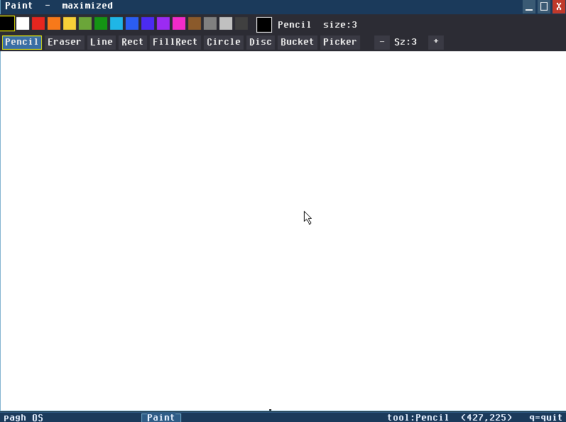
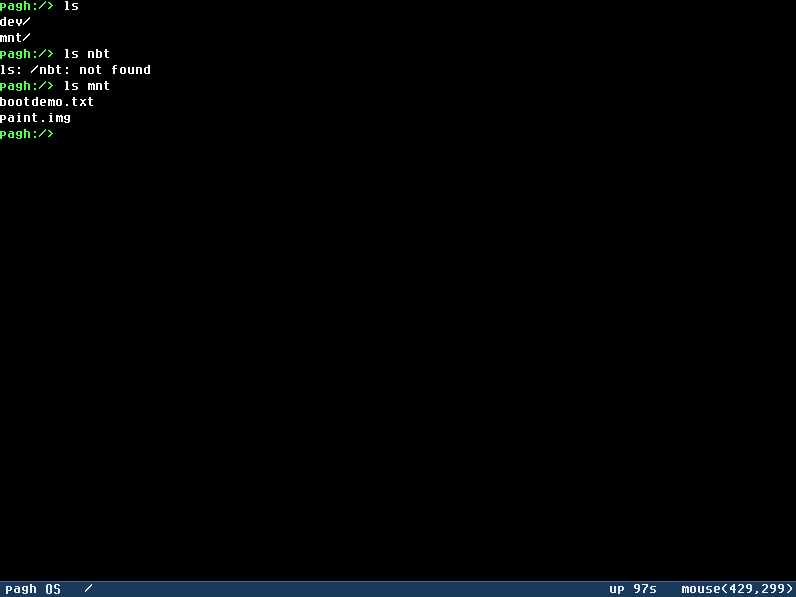
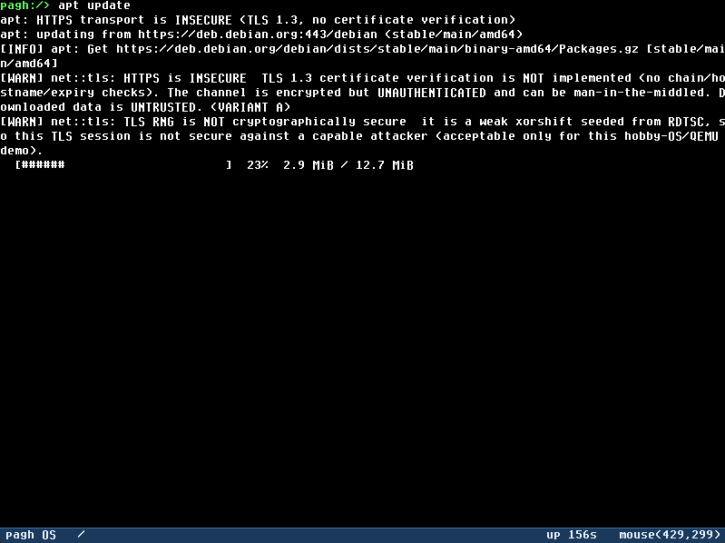

<h1 align="center">pagh</h1>

<p align="center">
  A small 64-bit OS kernel in Rust — ext2 + WAL journaling, a TCP/IP stack,
  a framebuffer GUI, and a mouse-driven paint app, booting on real UEFI via Limine.
</p>

<p align="center">
  
  
  
  
  
</p>

---

A small 64-bit operating system kernel written in Rust (`#![no_std]`), booted via the
[Limine](https://github.com/limine-bootloader/limine) boot protocol on x86_64 and run
under QEMU/OVMF.

`pagh` brings up serial, the GDT/IDT, a bitmap physical memory manager, 4-level paging,
a heap, the APIC (LAPIC timer + I/O APIC), a PS/2 keyboard and mouse, a framebuffer
console with 2D graphics primitives and a software cursor, a virtual filesystem, an ELF64
loader, a preemptive round-robin scheduler, a `SYSCALL`/`int 0x80` interface, PCI
enumeration with virtio drivers, a TCP/IP network stack, a journaled ext2 filesystem on a
real disk, and a friendly interactive shell with line editing, history, tab completion,
and colored output. It can load and run an embedded test program in ring 3, and ships a
windowed, mouse-driven `paint` application (a movable window with minimize/maximize/close
and a taskbar entry). It also runs **Linux x86_64 ELF
binaries — statically linked or dynamically linked against glibc (up to CPython 3.13) —**
in ring 3 through a Linux syscall-compatibility layer, includes an **`apt`-style package
manager** that fetches and installs Debian `.deb` packages by name over HTTP/HTTPS, and
**provisions a base glibc + Python userland** onto its ext2 disk on first boot.

> Hobby/educational kernel. There is no security model beyond ring 0/3 paging.

> **Safe default:** outbound package downloads are disabled in normal builds. The historical
> the development build enables network apt; HTTPS is encrypted but certificate and repository-signature verification are still pending, so downloaded packages remain untrusted
> for an isolated, developer-controlled QEMU mirror. See `SECURITY.md` and `HARDENING.md`.

> **Authorship:** this kernel was written by Claude Opus 4.8 under human supervision.

---

## Screenshots

### The `paint` app (maximized window)

The windowed, mouse-driven drawing app: title bar with minimize/maximize/close, a
16-color palette, tool buttons, and a "Paint" entry in the taskbar.



### Interactive shell

The framebuffer console with the color-coded `pagh:/mnt>` prompt and the bottom status
bar (OS name, current directory, uptime, live mouse position).



### `apt update` over HTTPS

The by-name package manager fetching the Debian `Packages` index over TLS 1.3, with the
honest INSECURE warnings (VARIANT A: encrypted but unauthenticated).



---

## Features at a glance

- **Core:** safe privileged-instruction layer (SSE enabled for ring 3; the kernel itself is compiled soft-float), GDT/IDT/TSS/IST,
  bitmap PMM, 4-level paging VMM with `map_mmio`, a `good_memory_allocator` (galloc) heap, ACPI (MADT),
  LAPIC + I/O APIC.
- **Tasking:** preemptive ~100 Hz round-robin scheduler, kernel threads, ring-3 user
  processes, `int 0x80` syscalls (`SYS_WRITE`/`EXIT`/`YIELD`).
- **Input & graphics:** PS/2 keyboard (IRQ1) and mouse (IRQ12), a framebuffer console with
  2D primitives (lines, rectangles, circles, fills, blit), a bottom status bar, and a
  trailing-free software mouse cursor.
- **Storage:** PCI enumeration, virtio-blk block device, a multi-block-group ext2-compatible
  read/write filesystem mounted at `/mnt` (GiB-scale disks), protected by a
  write-ahead-log (WAL) journal for crash consistency — large writes are committed in
  bounded per-transaction chunks. The on-disk image is host-mountable (`mount -t ext2 -o loop disk.img`).
- **Networking:** virtio-net NIC driven through [`smoltcp`](https://github.com/smoltcp-rs/smoltcp)
  — DHCPv4 addressing, ICMP echo (ping), UDP echo, and a TCP echo server + client.
- **Shell:** line editing (arrows/Home/End/Delete/insert), command history, tab
  completion, `cd`/`pwd` with relative paths, file ops (`cp`/`mv`/`stat`), colored
  prompt/errors, typo suggestions, a registry-driven `help`, and a `paint` app.
- **Linux binaries:** a Linux x86_64 syscall layer (`int 0x80` + `syscall`) and an ELF
  loader for static `ET_EXEC`, static-PIE, and glibc-dynamic (`PT_INTERP`) images run
  Linux programs in ring 3 (`lxrun`) — including the CPython 3.13 REPL (GNU readline
  works via `select`/`pselect6`). Threads/`fork`, signal delivery, `epoll`/`eventfd`,
  and GUI stacks are still out of scope.
- **Packages:** a by-name `apt` (`update`/`install`/`show`/`list`/`setmirror`) that fetches
  a Debian `Packages` index over HTTP/HTTPS, streams gzip/xz/zstd decompression into a
  compact in-RAM arena index, resolves dependencies, and installs `.deb`s onto ext2 `/mnt`
  (tar symlinks/hardlinks are materialized as file copies).
- **Provisioning:** an idempotent first-boot thread seeds `/mnt` and installs the base
  glibc + CPython 3.13 userland through `apt` (gz→xz index-decode fallback, honest
  decode diagnostics, progress on serial).

---

## Quick start

### Prerequisites

- **Rust nightly** with the `rust-src` component (for `build-std`):
  ```sh
  rustup toolchain install nightly
  rustup component add rust-src --toolchain nightly
  ```
  `rust-lld` ships with the toolchain and is used as the linker.
- **QEMU** (`qemu-system-x86_64`) on your `PATH`. `qemu-img` is used to create the disk
  image on first run.
- Two developer-provided blobs in the project root (they are git-ignored — see below):
  - `OVMF.fd` — UEFI firmware for QEMU.
  - `limine-12.3.1/` — the Limine bootloader tree (must contain `BOOTX64.EFI`).

### Build and run

#### Linux / Bash

Install QEMU/OVMF and the pinned Rust toolchain, then place Limine's
`BOOTX64.EFI` in `limine-12.3.1/` (or set `LIMINE_EFI`):

```bash
chmod +x setup-linux.sh build.sh run.sh
./setup-linux.sh                 # Ubuntu/Debian, Fedora, or Arch host packages
./build.sh                       # debug build + link
./build.sh --release --stage     # release build + Limine ESP staging
./run.sh --release               # build, stage, and boot in QEMU
./run.sh --headless              # serial-only QEMU
```

The scripts automatically detect common system OVMF locations. Override with
`OVMF=/path/to/OVMF.fd` or `OVMF_CODE` + `OVMF_VARS`. Other supported variables
are `LIMINE_DIR`, `LIMINE_EFI`, and `PAGH_DISK`. QEMU exits with `Ctrl-A`, then `X`.

`run.sh` creates a 1 GiB raw `disk.img` on first run and boots QEMU with 1 GiB of RAM.
On the first boot with networking, a background provisioning thread runs `apt update` and
installs the base `python3` userland onto the disk (≈50 MB of downloads). Delete
`disk.img` to get a clean re-provisioned system on the next boot.

The cross-platform Python equivalents remain available through `tools/build.py`
and the `Makefile`.

#### Windows

The `run.cmd` script drives the whole pipeline:

```bat
run.cmd build           :: cargo build + link PAGH.elf only
run.cmd run             :: build + link + boot in QEMU (default)
run.cmd run release     :: release build
```

`run.cmd`:
1. runs `cargo build` to produce the static library `libpagh.a`,
2. links it into `PAGH.elf` with `rust-lld` using `linker.ld`,
3. stages `iso_root/` (kernel + `BOOTX64.EFI` + a generated `limine.conf`),
4. creates a 64 MiB raw `disk.img` (via `qemu-img`) if it does not already exist,
5. launches QEMU with OVMF, a `virtio-blk-pci` drive, a `virtio-net-pci` NIC (user
   networking with host port-forwards), serial on stdio, and interrupt logging to
   `qemu_debug.log`.

The NIC is configured with host→guest forwards on TCP/UDP `localhost:5555 → guest :7`,
so you can reach the guest's echo services from the host.

Serial output (including the shell) appears on the console. Press `Ctrl-A` then `X` to
exit QEMU.

Just building the static library:

```sh
cargo build            # debug
cargo build --release  # release
```

---

## Boot output

On a clean boot you will see a concise, leveled log followed by the shell:

```
[INFO] serial
[INFO] base revision
[INFO] limine responses
[INFO] gdt + idt
[INFO] syscalls
[INFO] pmm
[INFO] vmm
[INFO] heap
[INFO] apic
[INFO] drivers
[INFO] virtio
[INFO] scheduler
[INFO] vfs
[INFO] ext2 mounted at /mnt
[INFO] fs demo: /mnt/bootdemo.txt write+read round-trip PASS (28 bytes)
[INFO] net
[INFO] user test process spawned (pid 3)
Hello from ring3 user process!
[INFO] interrupts enabled
[INFO] net: DHCP lease acquired: 10.0.2.15/24 gw 10.0.2.2
========================================
   Welcome to pagh OS Shell!
========================================
Type 'help' for available commands
pagh:/>
```

The default log level is `INFO`; `debug!`/`trace!` output is filtered out. Boot runs as an
ordered sequence of fallible init steps (`boot::start`); hardware SSE is enabled first
(ring-3 programs use XMM freely — the kernel itself is compiled soft-float and never
touches vector registers), then each step logs one concise `info!` line. The `ext2 mounted at /mnt` step also runs a one-shot
journaled write/read self-demo. The `Hello from ring3 user process!` line is printed by an
embedded ELF executing in ring 3 via a `SYS_WRITE` system call. The DHCP lease is acquired
asynchronously by the network poll thread once interrupts are enabled, so it appears after
the prompt. On a fresh disk a background provisioning thread then runs `apt update` and
installs the base `python3` userland (progress on serial; the framebuffer log mirror is
paused while it runs). The prompt shows the current working directory and is rendered in color on the
framebuffer (serial stays plain text).

### Shell commands

| Command              | Description                                                     |
|----------------------|-----------------------------------------------------------------|
| `help [cmd]`         | List commands, or show usage/description for one command        |
| `clear`              | Clear the framebuffer screen                                    |
| `echo …`             | Echo the arguments                                              |
| `uptime`             | Show scheduler ticks (~100 Hz)                                  |
| `pwd`                | Print the current working directory                             |
| `cd [path]`          | Change directory (relative or absolute; no arg → `/`)           |
| `ls [path]`          | List a directory (defaults to the CWD; dirs shown with `/`)     |
| `cat path`           | Print the contents of a file                                    |
| `cp src dst`         | Copy a file                                                     |
| `mv src dst`         | Move/rename a file                                              |
| `stat path`          | Show file/directory info                                        |
| `mkdir path`         | Create a directory                                              |
| `touch path`         | Create an empty file                                            |
| `write path text`    | Write text to a file (journaled)                                |
| `rm path`            | Remove a file or empty directory                                |
| `sync`               | Flush the mounted filesystem                                    |
| `fscrash`            | Demo journal replay + persistence (write → remount → verify)    |
| `sleep <seconds>`    | Sleep for N seconds                                             |
| `nano <path>`        | Full-screen editor: undo/redo, search, goto, line numbers       |
| `rust <path>`       | Run `.rs`/`.pbc` with mini-Rust or a static Rust ELF            |
| `rustc <file.rs>`    | Compile mini-Rust source into an offline `.pbc` package         |
| `cargo …`            | Create, check, build and run embedded mini-Rust projects        |
| `rustup …`           | Inspect the built-in offline mini-Rust toolchain                |
| `paint`              | Launch the windowed, mouse-driven framebuffer paint app         |
| `pci`                | List enumerated PCI devices (virtio tagged)                     |
| `ifconfig`           | Show the network interface (IP, gateway, MAC)                   |
| `nc <ip> <port> [t]` | Open a TCP connection and echo a line over it                   |
| `lxrun <path> […]`   | Load and run a Linux x86_64 ELF (static or glibc) in ring 3    |
| `python […]`         | Run the installed CPython 3.13 (glibc) via the Linux layer     |
| `pkg <url> <dst>`    | Download a file / `.deb` over HTTP(S) into the VFS              |
| `apt <subcmd> …`     | Package manager: `update`/`install`/`show`/`list`/`setmirror`   |
| `exec`               | Run the embedded ring-3 test process                            |
| `selftest`           | Run the in-kernel correctness self-test suite (serial)          |

**Line editing & UX.** The shell supports a movable cursor (Left/Right/Home/End),
mid-line insert/Backspace/Delete, command history (Up/Down), and Tab completion for
command names and VFS paths. Unknown commands get a nearest-match "did you mean …?"
suggestion. Paths are resolved against the current working directory (`.`/`..`
supported), and prompt/errors/success are color-coded on the framebuffer.

> Console note: the framebuffer console only supports destructive backspace and has no
> non-destructive cursor positioning, so during mid-line edits the visible caret rests at
> end-of-line while the logical cursor is placed correctly — the buffer content always
> renders accurately.

### Graphics & the `paint` app

The framebuffer driver is not just a text console: it exposes 2D primitives (pixels,
filled/outline rectangles, lines and thick lines, circles and discs, and `blit`) plus a
bottom status bar. A PS/2 mouse (IRQ12) feeds an absolute, screen-clamped cursor position
and button state, drawn as a trailing-free software arrow cursor (`drivers::cursor`) that
saves and restores the pixels beneath it.

`paint` ties these together into a windowed drawing application launched from the shell:

- **Window:** draws itself as a desktop window with a title bar (drag to move) and
  minimize / maximize / close buttons, plus a "Paint" taskbar button that toggles
  minimize; maximize stretches it to full screen.
- **Tools:** Pencil, Eraser, Line, Rectangle, Filled Rectangle, Circle, Disc, Bucket fill,
  and color Picker — shape tools show a live rubber-band preview while dragging.
- **Color:** a 16-entry palette (toolbar swatches, or number keys `1`–`0`); left button
  paints, right button quick-erases to white.
- **Editing:** keyboard shortcuts for tools, brush size (`[`/`]`), undo/redo (`u`),
  clear (`x`), maximize (`m`), and save/load the canvas to `/mnt/paint.img` (`s`/`g`) via
  the ext2 FS.
- **Exit:** the close button, `Esc`, or `q` returns to the shell.

### Trying the network from the host

With the guest booted (DHCP lease `10.0.2.15`):

```sh
# TCP echo (host forward 5555 → guest 7)
printf 'hello pagh' | nc 127.0.0.1 5555

# UDP echo (host forward 5555 → guest 7)
printf 'hello pagh' | nc -u 127.0.0.1 5555
```

From inside the guest shell you can also drive the TCP client: `nc 10.0.2.2 <port> text`.

---

## Rust applications and nano+

### Embedded mini-Rust

pagh includes an offline Rust-like toolchain designed for source written directly
in `nano+`. It is deliberately smaller than upstream rustc, Cargo and rustup, but
uses familiar commands and requires no network or host compiler.

```text
cargo new /mnt/hello
nano /mnt/hello/src/main.rs
cargo run /mnt/hello

nano /mnt/test.rs
rust /mnt/test.rs
rustc /mnt/test.rs -o /mnt/test.pbc
rust /mnt/test.pbc

rustup show
rustup target list
```

Supported mini-Rust syntax includes `fn main()`, integer variables and arithmetic,
integer arrays, `.iter().sum()`, `println!`/`print!`, assignments and integer
`for` ranges. Cargo supports `new`, `check`, `build`, and `run`. `.pbc` files are
portable source packages interpreted by the built-in runtime, not native ELF.

### Native Rust userspace

pagh can also run single-threaded, statically linked Rust programs compiled for
`x86_64-unknown-linux-musl`. Build the included example on the host:

```bash
tools/build-rust-app.sh rust-apps/hello
```

Copy `rust-apps/out/pagh-rust-hello` into the ext2 disk and run it in pagh:

```text
rust /mnt/pagh-rust-hello one two
```

For `.rs` and `.pbc`, the `rust` command selects the embedded interpreter. For
other files it selects the ring-3 Linux ELF loader. Dynamic linking, threads,
`fork`, futexes and GUI libraries remain unsupported for native binaries.

### nano+ editor

Open or create a file with `nano /mnt/file.rs`. The editor provides:

- line numbers and horizontal/vertical scrolling;
- `Ctrl-S` save and a double-`Ctrl-Q` unsaved-change guard;
- `Ctrl-Z` undo and `Ctrl-Y` redo (32 snapshots);
- `Ctrl-F` search, `Ctrl-R` replace-all and `Ctrl-G` go to line;
- Home/End, Page Up/Page Down, Delete, configurable Tab and auto-indent;
- `Ctrl-C` copy line, `Ctrl-K` cut line, `Ctrl-U`/`Ctrl-V` paste;
- persistent `nano --settings`, themes, line-number/whitespace toggles, wrapping, trimming and `.bak` backups;
- journaled truncate-before-rewrite with explicit save errors.

## Linux binaries & Debian packages

`pagh` can run Linux x86_64 programs — statically linked or glibc-dynamic — and install
Debian packages by name. On first boot it provisions a base userland automatically, so
`python` works out of the box.

```text
# run a Linux ELF already on the filesystem
lxrun /mnt/bin/busybox

# point apt at a mirror, refresh the index, then install + run a package
apt setmirror http://deb.debian.org /debian
apt update
apt install busybox-static
lxrun /mnt/bin/busybox

# CPython 3.13 (installed automatically on first boot)
python
```

- **Static and dynamic.** Statically-linked binaries and glibc-dynamic binaries both run:
  the loader maps the ELF interpreter (`ld-linux-x86-64.so.2`) from `/mnt` (with
  merged-`/usr` fallback paths), and CPython 3.13 works end to end.
  `fork`/`clone`/threads, signal delivery, `epoll`/`eventfd`, and GUI stacks are still
  out of scope and return `-ENOSYS` — event-loop TUIs (`nvim`, `htop`) do not run yet,
  though a fatal `tgkill` now ends the process cleanly (glibc `abort()` → exit 134).
- **Install ≠ run.** `apt install <pkg>` resolves the dependency closure, downloads each
  `.deb`, unpacks its files onto `/mnt`, and materializes tar symlinks/hardlinks as file
  copies (the ext2 writer has no symlink support). Console programs like `python3` then
  genuinely run. Interactive TUIs still may not: there is no `procfs` (`/proc/stat`,
  `/proc/meminfo`, per-pid entries), no `epoll`/`eventfd`, and no signal
  delivery. The console answers `TCGETS`/`TCSETS*`/`TIOCGWINSZ`/`TIOCSWINSZ` (non-tty
  fds get a proper `ENOTTY`), but stdin stays line-buffered, so ncurses/libuv programs
  (`htop`, `nvim`) still fail at startup. See `LINUX-USERLAND.md` for the exact status.
- **Transport.** Downloads use HTTP or HTTPS. HTTPS is **VARIANT A**: TLS 1.3 encrypted but
  **unauthenticated** (no certificate chain/hostname/expiry checks),
  and package data is not signature-verified — acceptable only for this hobby/QEMU demo.
  Treat downloaded data as untrusted.
- **Scale.** The full Debian `main` index (~60k packages, ~150 MiB decompressed) is streamed
  and parsed into a compact in-RAM byte-arena index (kept in RAM only, rebuilt per boot).
  End-to-end install is proven against a local mirror; a live full `apt update` from
  `deb.debian.org` works but is slow under QEMU user-mode networking (slirp) + TCG emulation.

---

## Architecture

```
Limine ──hands off──▶ _start (lib.rs) ──▶ boot::start()  (ordered init steps)
                                              │
   ┌───────────────┬───────────────┬─────────┼──────────┬───────────┬───────────┐
   ▼               ▼               ▼          ▼          ▼           ▼           ▼
arch::cpu       gdt/idt         memory      apic      drivers      fs / net    vfs /
(safe priv.   (descriptors,  (pmm/vmm/heap (LAPIC,   (serial,     (ext2+WAL,   scheduler
 instrs, SSE)  TSS, IST)      /layout)      I/O APIC) ps2_kbd/mouse,virtio-net  (lookup_path,
                                                      cursor,      + smoltcp)   ELF loader,
                                                      framebuf+gfx,             round-robin)
                                                      pci, virtio)
```

The kernel is built as a `staticlib` (`libpagh.a`) and linked into a higher-half ELF
(load address `0xffffffff80000000`, set by `linker.ld`).

### Source layout

```
src/
├── lib.rs              # crate attrs, Limine request statics, global cells, panic handler, _start
├── boot.rs             # boot orchestrator: ordered, fallible init steps (incl. storage + net)
├── log.rs              # leveled logging facade (error!/warn!/info!/debug!/trace!)
├── provision.rs        # idempotent first-boot provisioning (seed files + base apt userland)
├── test.rs             # in-kernel test/self-test harness (Properties P1–P27)
├── selftest_lx.rs      # boot-time Linux-compat + apt self-tests (cargo feature `lx_selftest`)
├── shell/              # interactive shell (thin I/O loop over pure-logic modules)
│   ├── mod.rs          #   prompt loop: Decoder + LineEditor + History + completion + dispatch
│   ├── keys.rs         #   KeyEvent + scancode Decoder (0xE0 extended-prefix state machine)
│   ├── editor.rs       #   LineEditor (buffer + char-unit cursor; insert/delete/move)
│   ├── history.rs      #   bounded command-history ring buffer with recall
│   ├── complete.rs     #   command + path tab completion, longest-common-prefix
│   ├── suggest.rs      #   bounded edit distance + nearest-command typo suggestion
│   ├── path.rs         #   CWD state + pure path normalize/resolve (`.`/`..`, clamp at root)
│   ├── registry.rs     #   single CommandSpec table driving dispatch and help
│   ├── render.rs       #   color palette + styled prompt/error/success (serial stays plain)
│   ├── commands.rs     #   command handlers (ls, cd, cat, cp, mv, stat, write, nc, …)
│   ├── nano.rs         #   full-screen text editor with undo/search/goto
│   ├── nano_config.rs  #   persistent nano+ settings (theme, tabs, backups)
│   ├── toolchain.rs    #   embedded cargo/rustc/rustup + mini-Rust runtime
│   └── paint.rs        #   windowed mouse-driven framebuffer paint application
├── arch/
│   ├── cpu.rs          # safe wrappers for privileged instrs (hlt/cli/sti/rd-/wrmsr, SSE)
│   └── x86_64/
│       ├── gdt.rs      # GDT, TSS, IST stacks, segment selectors, RSP0
│       ├── idt.rs      # IDT, exception handlers, IRQ + int 0x80 dispatch
│       ├── apic.rs     # LAPIC timer, I/O APIC, IRQ routing
│       ├── acpi.rs     # MADT parsing via the `acpi` crate (cached)
│       ├── syscall.rs  # SYSCALL/int 0x80 entry + dispatcher (native + Linux dispatch)
│       └── linux/      # Linux x86_64 syscall ABI: errno, io, mem, misc, stat, time, dirent…
├── memory/
│   ├── layout.rs       # single source of truth for fixed virtual regions
│   ├── pmm.rs          # bitmap physical frame allocator (single Spinlock; contiguous alloc)
│   ├── vmm.rs          # 4-level paging, PageTableWalker, map_mmio, VmError
│   └── heap.rs         # global allocator: IRQ-safe wrapper over galloc (O(1)-binned)
├── drivers/
│   ├── mod.rs          # device registry (block/char/console traits, sector_count)
│   ├── serial.rs       # 16550 UART (byte-accurate writes)
│   ├── ps2_kbd.rs      # PS/2 keyboard (IRQ1)
│   ├── ps2_mouse.rs    # PS/2 mouse (IRQ12): packet assembler + absolute cursor state
│   ├── cursor.rs       # trailing-free software arrow cursor (save/restore under-pixels)
│   ├── framebuffer.rs  # framebuffer console + 2D primitives (rect/line/circle/blit) + status bar
│   ├── pci/            # PCI config-space access + bus enumeration
│   └── virtio/         # virtio HAL (DMA frames + bounce buffers) + virtio-blk block device
├── fs/
│   ├── mod.rs          # FsError + filesystem plumbing
│   ├── ext2/           # ext2 layer: structs, bitmap alloc, inode map, dir entries, mount/format
│   │   ├── mod.rs      #   Ext2Fs mount/format (capacity-derived sizing), VfsNode impls
│   │   ├── structs.rs  #   on-disk superblock / group descriptor / inode / dirent layouts
│   │   ├── alloc.rs    #   block + inode bitmap allocation
│   │   ├── inode.rs    #   inode read/write + block mapping
│   │   └── dir.rs      #   directory entry iteration / insert / remove
│   └── journal.rs      # write-ahead-log (WAL) journal: begin/log/commit/recover
├── net/
│   ├── mod.rs          # smoltcp interface, DHCP, poll loop, UDP/TCP echo, nc client, resolve
│   ├── dns.rs          # pure DNS query build + A-record parse (resolver pump in mod.rs)
│   ├── http.rs         # pure HTTP/1.1 GET builder + response-head parser
│   ├── http_fetch.rs   # effectful HTTP fetch pump (Package_Fetcher) over a TCP socket
│   ├── progress.rs     # download/decompress progress reporting (fb-mirror aware)
│   ├── tls.rs          # HTTPS via TLS 1.3 (embedded-tls; VARIANT A — no cert verification)
│   └── phy.rs          # smoltcp Device adapter over virtio-net (RxToken/TxToken)
├── pkg/
│   ├── mod.rs          # package-manager plumbing
│   ├── apt.rs          # by-name apt front end: update / install / show / list / setmirror
│   ├── apt_index.rs    # compact byte-arena `Packages` index + streaming builder
│   ├── apt_resolve.rs  # pure dependency resolver (topological install plan)
│   ├── deb.rs          # `.deb`/ar parsing + gzip/xz/zstd (streaming) decompression
│   ├── tar.rs          # pure ustar reader/writer
│   ├── install.rs      # pure install-path normalization + model
│   ├── install_fs.rs   # effectful data.tar → ext2 /mnt installer
│   └── mirror.rs       # `apt setmirror` host/scheme/port argument parser
├── sync/
│   └── spinlock.rs     # IRQ-safe spinlock (built on arch::cpu)
├── task/
│   ├── scheduler.rs    # round-robin scheduler, TCB, idle task
│   ├── switch.rs       # context-switch asm, kernel-thread trampoline, timer IRQ stub
│   ├── process.rs      # ring-3 user process creation + embedded test ELF
│   ├── compat.rs       # per-process Linux compat state registry (fds, vm regions)
│   ├── fd.rs           # per-process file-descriptor table (VFS-backed)
│   ├── fd_alloc.rs     # pure fd-number bookkeeping (lowest-free ≥ 3, EBADF)
│   ├── stack.rs        # pure SysV initial-stack / auxv encoder
│   └── stack_map.rs    # effectful user-stack mapping for the SysV image
├── vfs/
│   ├── mod.rs          # VfsNode trait, root, lookup_path, mount_at, /dev/{null,serial}
│   ├── elf.rs          # ELF64 validation + PT_LOAD loading (native + Linux static/PIE)
│   └── elf_classify.rs # pure ELF classifier + static-PIE load-bias selection
├── security/
│   └── entropy.rs      # hardware-backed, fail-closed entropy (RDSEED/RDRAND)
└── debug/
    └── unwind.rs       # heap-free RBP-chain stack trace for panics
```

### Design notes

- **Safe abstraction layer.** Privileged instructions are funneled through `arch::cpu`;
  no module outside `arch` contains inline `asm!` except the unavoidable `task::switch`
  stubs and the GDT segment reload. Global mutable state (GDT/TSS/IDT, APIC MMIO bases,
  the serial port) is reached through `SyncUnsafeCell` raw pointers or atomics rather than
  references to `static mut`, so the tree builds with **zero warnings** and no
  `static_mut_refs` hazards. The `unsafe` that remains is documented with `// SAFETY:`
  comments.
- **Memory.** `memory::layout` centralizes fixed virtual regions. The PMM reserves the
  kernel image, the bitmap's own frames, and everything below 1 MB, and offers
  contiguous-frame allocation for DMA. `free_frame`/`free_frames_contiguous` refuse to
  return any reserved frame (below 1 MB, kernel image, or the bitmap itself) to the
  allocatable pool, so a stray free cannot corrupt the pool. The VMM propagates
  `USER_ACCESSIBLE` through intermediate page tables and exposes
  `map_mmio`/`identity_map_range`. The global heap allocator is an IRQ-safe wrapper over
  galloc (interrupts are disabled while the allocator lock is held), so allocation from
  interrupt context can never deadlock the kernel.
- **Storage.** virtio-blk presents a `BlockDevice` that reports its real capacity via
  `sector_count`. The ext2 layer sizes the filesystem from that capacity across multiple
  32768-block groups (with backup superblocks/group descriptors and free-count
  reconciliation on mount), and routes every mutating write (data, inode, bitmap, dirent)
  through the WAL journal; large file writes are split into bounded per-transaction chunks
  so any file size fits the fixed journal area. `recover()` replays committed transactions
  on mount and discards torn ones, giving crash consistency. The image is plain ext2, so it can be inspected on the host.
- **DMA.** The kernel heap maps one independently-allocated physical frame per virtual
  page, so a multi-page buffer is virtually contiguous but physically fragmented. The
  `virtio` HAL detects this and, for fragmented buffers, hands the device a
  physically-contiguous bounce buffer, copying bytes in on `share` and back out on
  `unshare` per the transfer direction; already-contiguous buffers take the direct path.
- **Networking.** A `smoltcp::phy::Device` adapter wraps virtio-net, delivering each RX
  frame to smoltcp exactly once with single-owner buffer discipline. A dedicated kernel
  thread runs the poll loop; addressing is DHCPv4 with a static fallback. Outbound package
  fetches add a pure DNS resolver, a pure HTTP/1.1 client, and an HTTPS path over TLS 1.3
  (`embedded-tls`) — the TLS path is **VARIANT A: encrypted but unauthenticated** (no
  certificate verification). The development build enables it through the default `network_packages` feature; use `--no-default-features` for a fail-closed build.
- **Shell.** The interactive loop is the only place that touches the keyboard, console,
  and VFS; all the interesting logic (path normalization, the line-editor model, history,
  completion, the scancode decoder, edit distance) is pure and property-tested. A single
  `CommandSpec` registry drives both dispatch and `help`.
- **Scheduling.** A ~100 Hz LAPIC timer preempts via `irq32_stub`. The preemptive tick,
  the cooperative `SYS_YIELD` path, and a freshly spawned kernel thread all use one
  identical saved-frame layout, so a task suspended by any path resumes correctly through
  any other. Kernel threads and ring-3 tasks share this frame; the idle task (pid 0) is
  explicit. The cooperative switch saves its frame with interrupts disabled (matching the
  timer stub's IF=0 restore window), so a context is always restored interrupt-atomically
  and a timer tick can never corrupt a partially-restored frame. Exiting kernel threads
  park in an interrupt-enabled `sti; hlt` loop until the scheduler reaps them, so thread
  exit can never freeze the machine.
- **User mode.** `task::process` loads an ELF into a fresh user PML4, programs `TSS.RSP0`,
  and builds an `iret` frame that drops to ring 3. System calls use `int 0x80`
  (`rax`=number, `rdi/rsi/rdx`=args).
- **Linux binaries.** A Linux x86_64 syscall layer (`int 0x80` + `syscall` → a single
  dispatcher) plus an ELF loader for static `ET_EXEC`, static-PIE, and `PT_INTERP` dynamic images, a
  SysV initial stack/auxv builder, and per-process compat state (fd table, VM regions) let
  Linux programs — including glibc-dynamic ones such as CPython 3.13 — run in ring 3
  (`lxrun`). `fork`/`clone`/threads, signals/`epoll`, and GUI stacks are deliberately
  out of scope and return `-ENOSYS` (`futex` is handled just far enough for
  single-threaded glibc locking).
- **Packages (apt).** `apt` fetches a Debian `Packages` index and parses it incrementally
  from a streaming gzip/xz/zstd decompressor into a **compact byte-arena index** — one
  growable byte arena plus `(offset,len)` references and integer-keyed sorted lookup tables,
  instead of hundreds of thousands of per-field `String`s — so the full `main` index fits in
  bounded RAM. The streaming stanza parser itself reuses one fixed `String` slot per field
  and `clear()`s them between stanzas, so it does **no** per-stanza heap alloc/free; combined
  with a size-binned global allocator (`good_memory_allocator`/galloc, replacing
  `linked_list_allocator`), index parsing stays ~O(n) instead of degrading to O(n²) on the
  allocator free-list — the earlier symptom that looked like a hang and corrupted the heap.
  A pure resolver produces a dependency-first plan, then each `.deb` is fetched, its
  `data.tar` unpacked, and files written onto ext2 `/mnt`.
- **Input & graphics.** The PS/2 keyboard (IRQ1) and mouse (IRQ12) are routed through the
  I/O APIC. The mouse driver assembles 3-byte packets and maintains an absolute,
  screen-clamped position. The framebuffer driver offers 2D primitives over the
  Limine-provided linear framebuffer; the software cursor saves/restores the pixels under
  the arrow so it leaves no trail, and `paint` composites onto an in-heap canvas it can
  read back (preview, flood fill, undo, save/load).

---

## Correctness properties & testing

The kernel ships an in-QEMU harness (`src/test.rs`) covering 27 correctness properties.
Each property routine runs ≥100 randomized iterations against pure logic or a RAM-mock
device (no hardware dependency). Run them from the shell with `selftest`; results print
over serial as `ok`/`FAIL` lines.

For logic that is cleanly extractable to the host, a separate, workspace-excluded
`host-tests/` crate runs [`proptest`](https://crates.io/crates/proptest)-based property
tests with `cargo test` (it builds for the host triple, not the bare-metal target). Run
it from that directory:

```sh
cd host-tests && cargo test
```

The host suite now carries **41** property modules (`p01`–`p41`). Beyond the kernel-core
properties listed below it covers the Linux-compat and package logic added since: the ELF
classifier and static-PIE bias, the SysV stack/auxv encoder, fd-number bookkeeping, DNS
query/response and HTTP head parsing, `.deb`/`ar`/`tar` handling, gzip/xz/zstd decode
round-trips, and the `apt` index/resolver — including the compact arena index checked for
query-equivalence against a reference `String`-backed model.

| #     | Property                                                            |
|-------|---------------------------------------------------------------------|
| P1    | PMM allocate/free round-trip conserves the free count               |
| P2    | PMM never allocates reserved memory (< 1 MB, kernel, bitmap)        |
| P3    | VMM map → translate → unmap consistency                             |
| P4    | `USER_ACCESSIBLE` propagates to intermediate page tables            |
| P5    | Heap allocations are non-overlapping and aligned                    |
| P6    | Spinlock restores the interrupt flag on release                     |
| P7    | Context-switch frame layout matches the restore order               |
| P8    | ELF loader rejects malformed binaries (no panic / no map)           |
| P9    | Logging level filter monotonicity                                   |
| P10   | Journal replay reaches the committed post-state (atomic commit)     |
| P11   | Uncommitted transactions leave the pre-state (atomicity)            |
| P12   | Journal replay idempotence                                          |
| P13   | Journal record integrity detects corruption                        |
| P14   | Block read/write round-trip                                         |
| P15   | Contiguous frame allocation is non-overlapping and contiguous       |
| P16   | Virtqueue buffers are never aliased (no double-use)                 |
| P17   | smoltcp poll preserves frames (no loss under bounded buffering)     |
| P18   | Filesystem operation round-trip through the VFS                     |
| P19   | ext2 directory entry `rec_len`/`name_len` round-trip + tiling       |
| P20   | Freshly formatted ext2 superblock is valid and self-consistent      |
| P21   | Path normalization is canonical, idempotent, and never escapes root |
| P22   | Line-editor buffer/cursor invariants hold under arbitrary edits     |
| P23   | History recall round-trips and stays bounded and deduplicated       |
| P24   | Tab completion uses the true longest common prefix                  |
| P25   | Extended scancodes decode to navigation keys, never to characters   |
| P26   | Typo suggestion picks a true nearest command                        |
| P27   | The decoder and editor never panic on arbitrary input               |

---

## Build constraints

These are required and preserved across the codebase:

- `#![no_std]`, `panic = "abort"` (dev and release).
- Custom target `x86_64-unknown-none.json` with `build-std = [core, compiler_builtins, alloc]`.
- Limine request statics live in the `.requests` section.
- Higher-half load address `0xffffffff80000000` (`linker.ld`).
- Frame pointers forced on (`-Cforce-frame-pointers=yes`) for the panic stack trace.
- The kernel is compiled **soft-float** (`"rustc-abi": "softfloat"`; SSE/AVX disabled in
  the target spec): syscalls, interrupts, and context switches never touch user
  XMM/MXCSR state, which the Linux syscall ABI requires to be preserved.

### Key dependencies

- [`acpi`](https://crates.io/crates/acpi) — MADT parsing.
- [`good_memory_allocator`](https://crates.io/crates/good_memory_allocator) — kernel heap (galloc; size-binned, ~O(1) alloc/free).
- [`virtio-drivers`](https://crates.io/crates/virtio-drivers) — virtio-blk / virtio-net.
- [`smoltcp`](https://crates.io/crates/smoltcp) — TCP/IP stack (no_std, alloc).
- [`embedded-tls`](https://crates.io/crates/embedded-tls) — TLS 1.3 client for HTTPS (VARIANT A).
- [`miniz_oxide`](https://crates.io/crates/miniz_oxide) / [`xz4rust`](https://crates.io/crates/xz4rust) / [`ruzstd`](https://crates.io/crates/ruzstd) — gzip / xz / zstd decompression for `.deb`s and the package index.
- [`proptest`](https://crates.io/crates/proptest) — host-side property tests (dev-dependency; `host-tests/`).

---

## Repository hygiene

Generated, large, or environment-specific files are git-ignored (see `.gitignore`):
`target/`, `host-tests/target/`, `iso_root/`, `PAGH.elf`, `disk.img`, `OVMF.fd`,
`limine-12.3.1/`, QEMU runtime logs, and editor/IDE folders (`.vscode/`, `.kiro/`,
`.idea/`).

`OVMF.fd` and `limine-12.3.1/` are kept on disk but ignored — they are downloaded
locally and required by `run.cmd`. `disk.img` is created automatically on first run.

---

## Contributing

Contributions are welcome. Please read the contributing guide before opening a PR — it
covers the toolchain setup, the build/run pipeline, the two-tier test story (in-QEMU
`selftest` + host `proptest`), and the build invariants that must be preserved:

- [`CONTRIBUTING.en.md`](CONTRIBUTING.en.md) (English)
- [`CONTRIBUTING.md`](CONTRIBUTING.md) (Русский)

Bug reports and feature requests use the issue templates under
[`.github/ISSUE_TEMPLATE`](.github/ISSUE_TEMPLATE); pull requests get a checklist from
[`.github/PULL_REQUEST_TEMPLATE.md`](.github/PULL_REQUEST_TEMPLATE.md).

## License

Licensed under the [MIT License](LICENSE).

